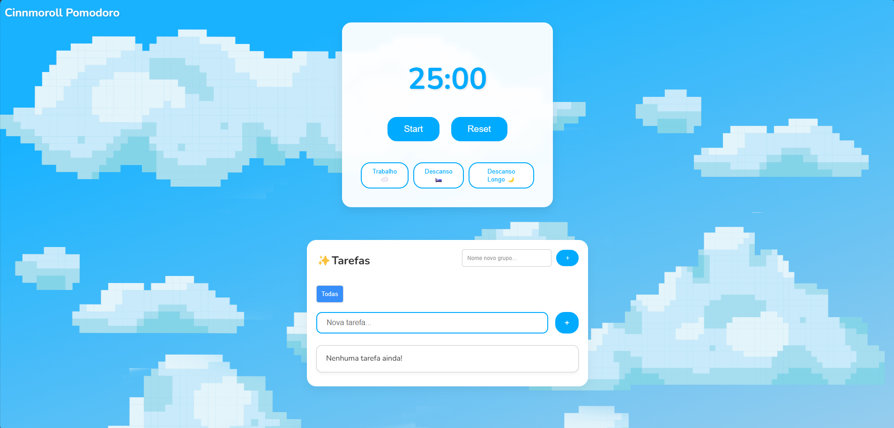

# Pomodoro Tasks

<div style="display: flex; justify-content: space-around;">
  
  
</div>

🚀 **Aviso:** O site pode demorar um pouco para carregar devido ao uso do plano gratuito da Render.

## 📌 Sobre o Projeto

O **Pomodoro Tasks** é uma aplicação web que combina a técnica Pomodoro com gerenciamento de tarefas. Ideal para aumentar a produtividade e organizar suas atividades diárias.

🔗 **Acesse o projeto:** [Pomodoro Tasks](https://pomodoro-tasks.onrender.com/)

## 🔧 Tecnologias Utilizadas

- **Python:** Lógica e backend da aplicação.
- **Flask:** Framework web para criação de rotas e renderização de templates.
- **HTML, CSS e JavaScript:** Construção da interface do usuário.
- **Render:** Plataforma utilizada para hospedar a aplicação (plano gratuito).

## 📋 Funcionalidades

- **Gerenciamento de Tarefas:** Adicionar, editar e remover tarefas.
- **Ciclos Pomodoro:** Iniciar, pausar e monitorar os ciclos de trabalho e descanso.
- **Interface Responsiva:** Design intuitivo para uma experiência fluida em diferentes dispositivos.

## 🚀 Como Rodar o Projeto Localmente

1. Clone o repositório:

   ```bash
   git clone https://github.com/IuryyNogueira/Pomodoro-Tasks.git
   ```

2. Entre na pasta do projeto:

   ```bash
   cd Pomodoro-Tasks
   ```

3. Crie e ative um ambiente virtual (opcional, mas recomendado):

   ```bash
   python -m venv venv
   source venv/bin/activate  # Para Linux/Mac
   venv\Scripts\activate     # Para Windows
   ```

4. Instale as dependências:

   ```bash
   pip install -r requirements.txt
   ```

5. Inicie a aplicação:
   ```bash
   python app.py
   ```
